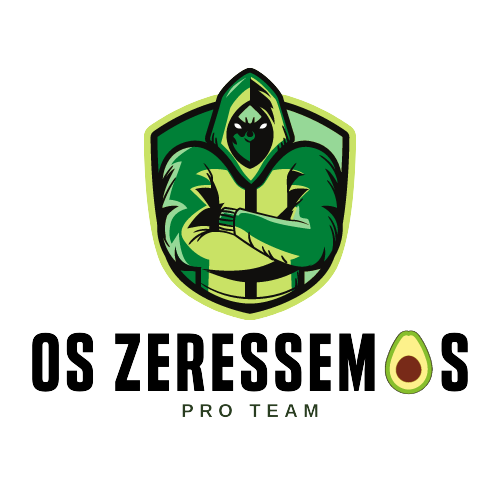
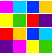

 <a name="back-to-top">
   &nbsp;&nbsp;&nbsp;&nbsp;&nbsp;&nbsp;&nbsp;&nbsp;&nbsp;&nbsp;&nbsp;&nbsp;&nbsp;&nbsp;&nbsp;&nbsp;&nbsp;&nbsp;&nbsp;&nbsp;&nbsp;&nbsp;&nbsp;&nbsp;&nbsp;&nbsp;&nbsp;&nbsp;&nbsp;&nbsp;&nbsp;&nbsp;&nbsp;&nbsp;&nbsp;&nbsp;&nbsp;&nbsp;&nbsp;&nbsp;&nbsp;&nbsp;&nbsp;&nbsp;&nbsp;&nbsp;&nbsp;&nbsp;&nbsp;&nbsp;&nbsp;&nbsp;&nbsp;&nbsp;&nbsp;&nbsp;&nbsp;&nbsp;&nbsp;&nbsp;&nbsp;&nbsp;&nbsp;&nbsp;&nbsp;&nbsp;&nbsp;&nbsp;&nbsp;&nbsp;&nbsp;

<h1 align="center">Desenvolvimento Mobile</h1>
<h3 align="center">Professor Ramon</h3>
 

##  Conteúdo Programático
✔️ Entender os conceitos do desenvolvimento mobile. 
✔️ Saber utilizar um framework frontend mobile. 
✔️ Saber configurar o ambiente de desenvolvimento mobile. 
✔️ Criar a estrutura do projeto. 
✔️ Utilizar uma ferramenta de gerenciamento, construção, deploy e emulação para aplicações mobile. 
✔️ Utilizar IDE e plugins para desenvolvimento de aplicações mobile. 
✔️ Criar componentes de classe. 
✔️ Gerenciar propriedades. 
✔️ Gerenciar estados. 
✔️ Criar componentes funcionais. 
✔️ Fazer layout e estilização. 
✔️ Definir navegação. 
✔️ Desenvolver aplicativo utilizando banco de dados embarcado. 
✔️ Realizar requisições à API backend (get, post, put e delete). 
✔️ Estilizar a interface do usuário com visual nativo do sistema operacional. 

*Totalizando 66h*
  

##  Atividades
- [Material de Aula](materialDeAula/) 
- 

   
Clonar um Aplicativo

      Escolher um aplicativo das lojas e recriar a interface de duas telas, utilizando React Native. 
      As telas devem ser: 
      - 1 Tela de Login 
      - 1 Tela Principal ou uma de sua escolha. 

 - [PicPay](https://github.com/marcosbarker/PicPay-clone)

## 🥑    Projeto Final 
 &nbsp;&nbsp;&nbsp;&nbsp;&nbsp;&nbsp;**ZEROPRODUTOS Avocado Store**    [*(Enunciado)*](https://github.com/marcosbarker/ZeroProdutos/blob/main/assets/doc.md)
* [**Repositório**](https://github.com/marcosbarker/ZeroProdutos)
 

##  Tecnologia Utilizada
- [**Node**](https://nodejs.org/en/)    [(*Documentação*)](https://nodejs.org/en/docs/)
- [**npm**](https://www.npmjs.com/)    [(*Documentação*)](https://docs.npmjs.com/)
- [**React Native**](https://reactnative.dev/)    [(*Documentação*)](https://reactnative.dev/docs/getting-started)
- [**Visual Studio Code**](https://code.visualstudio.com/)    [*(Documentação)*](https://code.visualstudio.com/docs)

 

&emsp;&emsp;&emsp;&emsp;&emsp;&emsp;&emsp;&emsp;&emsp;&emsp;&emsp;&emsp;&emsp;&emsp;&emsp;&emsp;&emsp;&emsp;&emsp;&emsp;⬆️[**Back to top**](#back-to-top)⬆️